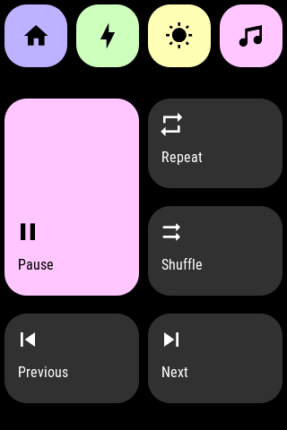

## openHASP_pastel

openHASP_pastel is a simple, beginner friendly, good looking theme for openHASP. Complexity is kept to a minimal, so to make this theme more accessible to newcomers.

Features: 
  - Best suited for a wall plate to control devices in one given room
  - Temperature, Humidity overview
  - 4 scene buttons
  - control up to 6 light sources
  - turn on/off up to 6 devices
  - media control for one tv/speaker device


## Installation

1. [Set up openHasp](https://www.openhasp.com/0.6.3/getting-started/) on your device. Select material dark as your theme.
2. Copy the content of `pages.jsonl` to your device. See pages.jsonl customization section below
3. Copy `openhasp_pastel.yaml` to your homeassistant folder. Edit and replace all instances of `plate05` to the name of your openhasp device. See Configuration Notes below
4. Edit your `configuration.yaml` and add the following:

```
homeassistant:
  packages:
    openhasp_homekit: !include openhasp_pastel.yaml
```

Restart the device and then restart Home Assistant. If the configuration was set up properly, it should work

## pages.jsonl customization

You will need to customize the content of pages.jsonl so they reflect the devices in your home and the text, icons of your choice. Page 1 features 4 scene buttons which you may want to change the text/icon for. Page 2 and 3 each features 6 devices that you may want to update the text and icon for. Delete any extra buttons that you don't have any devices for.

## openhasp_pastel.yaml customization

Edit the content of openhasp_pastel.yaml so it reflects the devices that you have at home. Starting with temperature and humidity, change the entity name to yours. Next, there are 4 scene buttons each mapped to a different scene. This is where you choose which scene gets triggered when you press the button. Page 2 and 3 each features 6 devices, configured similarly. On page 4, it is best to do a search and replace and replace `media_player.sonos_speaker` for the name of the media device you wish to control


## Screensots

### page 1 and page 2
  

### page 3 and page 4
  

```
